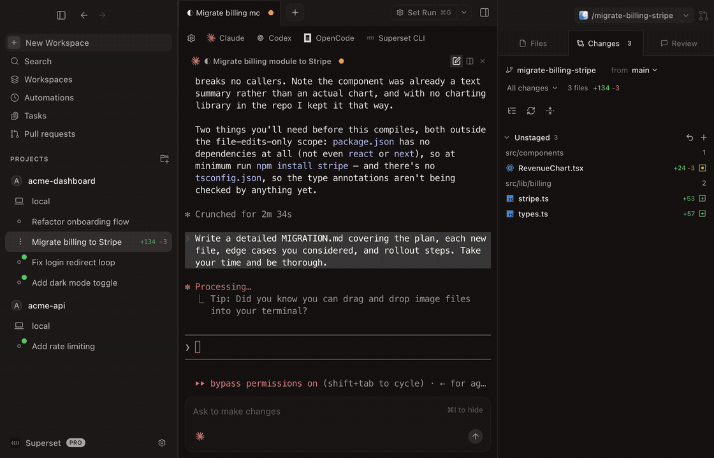
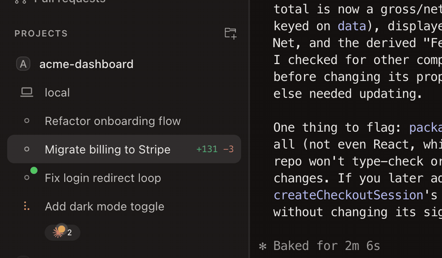
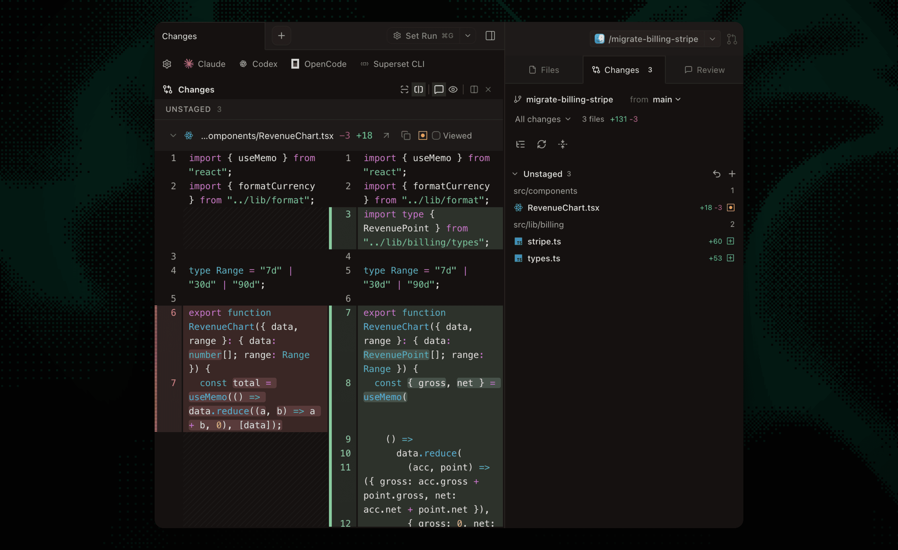
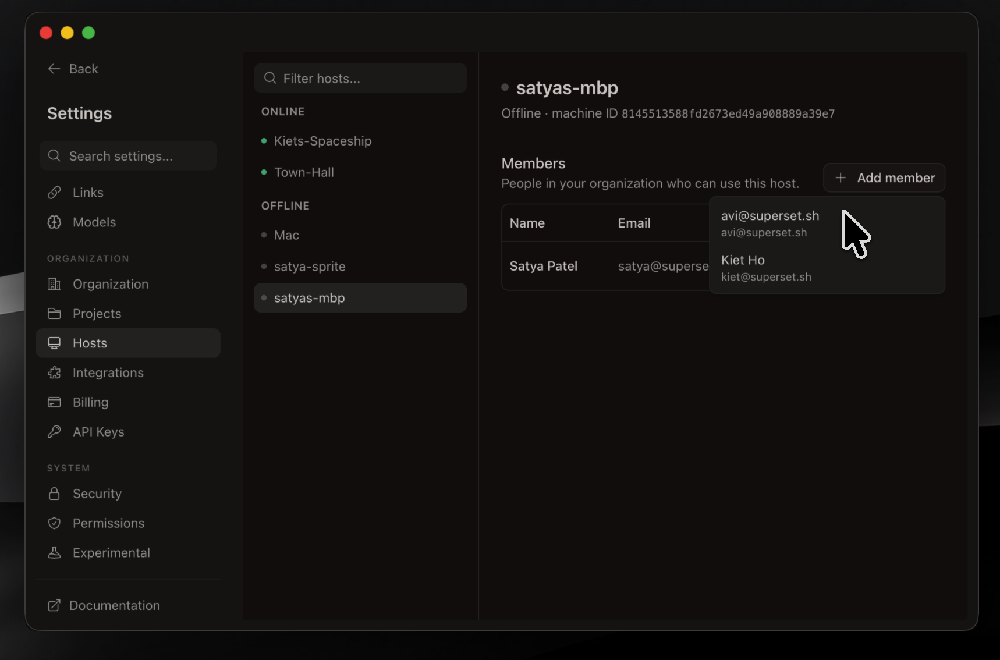
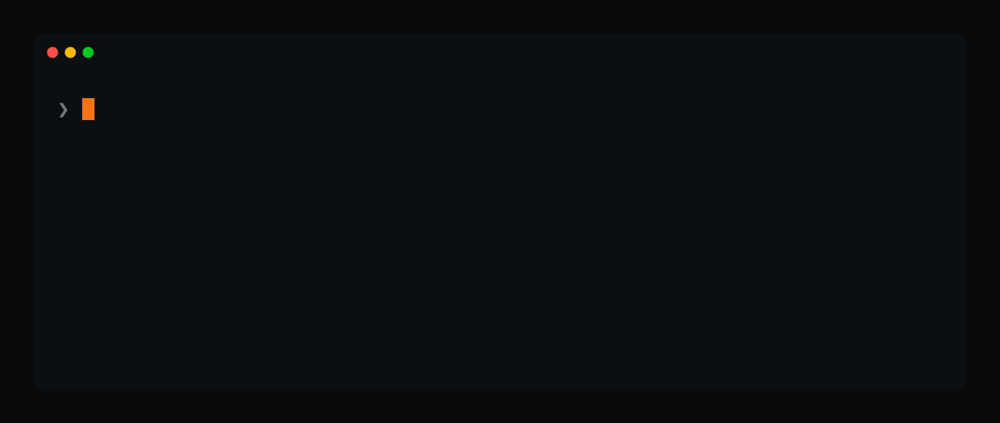
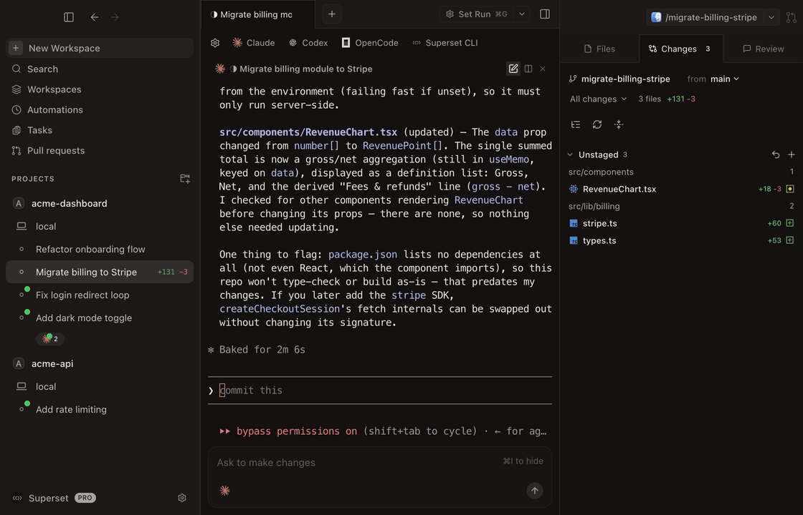
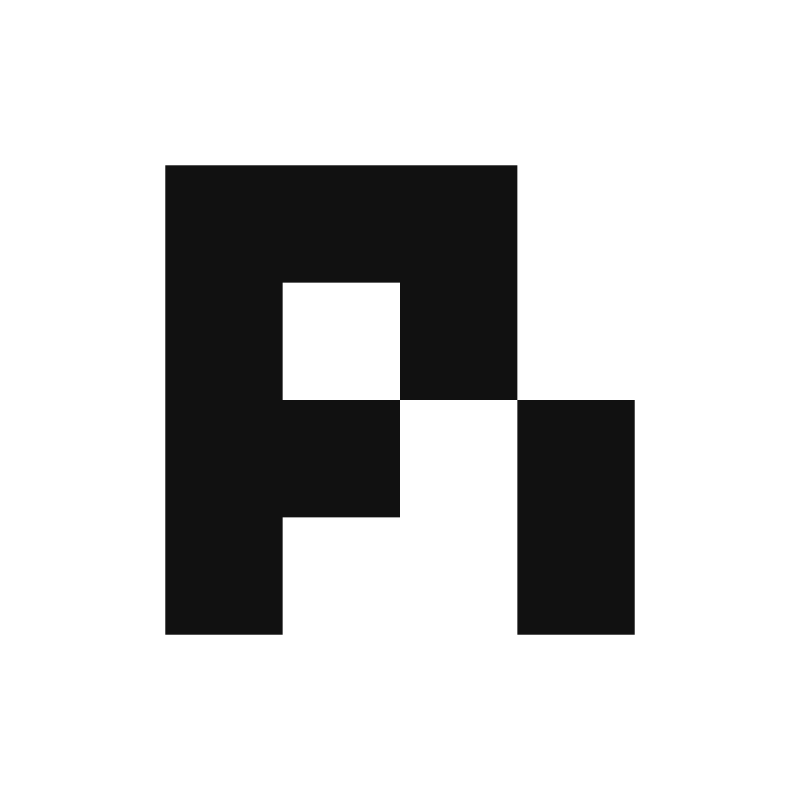

<div align="center">


### Jalankan 100+ Agen Coding Secara Paralel

<details>
<summary>🌐 Baca dalam bahasa lain</summary>
<br />

[English](../README.md) | [日本語](README.ja.md) | [简体中文](README.zh-CN.md) | [繁體中文](README.zh-TW.md) | [한국어](README.ko.md) | [Français](README.fr.md) | [Español](README.es.md) | [Deutsch](README.de.md) | [Português](README.pt-BR.md) | [Italiano](README.it.md) | [Русский](README.ru.md) | [Türkçe](README.tr.md) | [Polski](README.pl.md) | [Nederlands](README.nl.md) | [Bahasa Indonesia](README.id.md) | [Čeština](README.cs.md) | [Tiếng Việt](README.vi.md)

</details>

*Ini adalah terjemahan dari README bahasa Inggris, yang menjadi acuan resmi.*

[](https://github.com/superset-sh/superset/stargazers)
[](https://github.com/superset-sh/superset/releases)
[](../LICENSE.md)
[](https://x.com/superset_sh)
[](https://discord.gg/cZeD9WYcV7)

<br />

Claude Code, Codex, atau agen CLI apa pun, masing-masing di worktree terisolasinya sendiri.<br />
Habiskan waktu Anda untuk shipping, bukan menunggu.

<br />

[**Unduh untuk macOS**](https://github.com/superset-sh/superset/releases/latest) &nbsp;&bull;&nbsp; [Dokumentasi](https://docs.superset.sh) &nbsp;&bull;&nbsp; [Changelog](https://github.com/superset-sh/superset/releases) &nbsp;&bull;&nbsp; [Discord](https://discord.gg/cZeD9WYcV7)

<br />


</div>

## Coding 10x Lebih Cepat Tanpa Biaya Berpindah Konteks

Superset menjalankan agen coding berbasis CLI secara paralel di git worktree yang terisolasi, dengan alur kerja terminal, review, dan buka-di-editor bawaan.

- **Jalankan banyak agen sekaligus** tanpa beban berpindah konteks
- **Isolasi tiap tugas** di git worktree-nya sendiri sehingga agen tidak saling mengganggu
- **Pantau semua agen Anda** dari satu tempat dan dapatkan notifikasi saat mereka butuh perhatian
- **Review dan edit perubahan dengan cepat** lewat diff viewer dan editor bawaan
- **Buka workspace mana pun di tempat yang Anda butuhkan** dengan serah terima sekali klik ke editor atau terminal Anda
- **Akses workspace Anda dari mana saja** lewat host jarak jauh, CLI, SDK, atau MCP

Lebih sedikit menunggu, lebih banyak shipping.

## Fitur

<table>
<tr>
<td width="50%" valign="middle">

### Workspace Paralel

Jalankan 100+ agen coding sekaligus, masing-masing di git worktree-nya sendiri dengan branch, terminal, dan lingkungannya sendiri. Bandingkan hasilnya dan merge pemenangnya.

[Dokumentasi →](https://docs.superset.sh/workspaces)

</td>
<td width="50%">
  <a href="https://docs.superset.sh/workspaces"></a>
</td>
</tr>
<tr>
<td width="50%" valign="middle">

### Pemantauan Agen

Lacak setiap agen dari sidebar, dengan indikator bekerja, bunyi penanda selesai, dan badge dock saat ada yang butuh perhatian Anda.

[Dokumentasi →](https://docs.superset.sh/agent-integration)

</td>
<td width="50%">
  <a href="https://docs.superset.sh/agent-integration"></a>
</td>
</tr>
<tr>
<td width="50%" valign="middle">

### Terminal Bawaan

Tab, split tanpa batas, preset, dan sesi persisten yang bertahan setelah restart. Tekan ⌘I untuk editor prompt kaya dengan pengeditan multibaris dan mention file dengan @.

[Dokumentasi →](https://docs.superset.sh/terminal-integration)

</td>
<td width="50%">
  <a href="https://docs.superset.sh/terminal-integration"></a>
</td>
</tr>
<tr>
<td width="50%" valign="middle">

### Diff Viewer Bawaan

Periksa, komentari, dan edit perubahan agen tanpa meninggalkan aplikasi, lalu commit dan push saat sudah siap.

[Dokumentasi →](https://docs.superset.sh/diff-viewer)

</td>
<td width="50%">
  <a href="https://docs.superset.sh/diff-viewer"></a>
</td>
</tr>
<tr>
<td width="50%" valign="middle">

### Browser Dalam Aplikasi & Port

Pratinjau server dev yang berjalan di panel browser. Port dideteksi per workspace, jadi setiap worktree mendapat pratinjaunya sendiri.

[Dokumentasi →](https://docs.superset.sh/browser)

</td>
<td width="50%">
  <a href="https://docs.superset.sh/browser"></a>
</td>
</tr>
<tr>
<td width="50%" valign="middle">

### Otomatisasi

Jalankan sesi agen sesuai jadwal: triase issue semalaman, susun draf changelog mingguan, jaga dependensi tetap mutakhir.

[Dokumentasi →](https://docs.superset.sh/automations)

</td>
<td width="50%">
  <a href="https://docs.superset.sh/automations"></a>
</td>
</tr>
<tr>
<td width="50%" valign="middle">

### Akses Jarak Jauh

Hubungkan mesin lain dan akses workspace-nya dari mana saja: aplikasi desktop, CLI, atau ponsel Anda. Bangunkan host yang offline dengan perintah kustom.

[Dokumentasi →](https://docs.superset.sh/remote-access)

</td>
<td width="50%">
  <a href="https://docs.superset.sh/remote-access"></a>
</td>
</tr>
<tr>
<td width="50%" valign="middle">

### Superset CLI

Skrip dari shell mana pun: buat workspace, luncurkan agen, baca terminal mereka, dan kelola otomatisasi dengan satu binary. Kalau sebuah agen bisa menjalankan perintah, ia bisa mengendalikan Superset.

[Dokumentasi →](https://docs.superset.sh/cli/getting-started)

</td>
<td width="50%">
  <a href="https://docs.superset.sh/cli/getting-started"></a>
</td>
</tr>
<tr>
<td width="50%" valign="middle">

### Palet Perintah

Lompat ke workspace, aksi, atau pengaturan mana pun dari satu kotak pencarian.

[Dokumentasi →](https://docs.superset.sh/keyboard-shortcuts)

</td>
<td width="50%">
  <a href="https://docs.superset.sh/keyboard-shortcuts"></a>
</td>
</tr>
</table>

**Juga sudah termasuk:**

- **[Skill bawaan](https://docs.superset.sh/skills)**: agen sudah dimuat dengan skill `superset:*` (mengorkestrasi agen paralel, menjadwalkan otomatisasi, mengirim umpan balik, mendiagnosis masalah), disediakan otomatis saat diluncurkan
- **[Pemilih model & agen kustom](https://docs.superset.sh/agent-integration)**: pilih model dan tingkat penalaran saat meluncurkan, dan tambahkan agen terminal apa pun dengan ikonnya sendiri
- **[Skrip setup workspace](https://docs.superset.sh/setup-teardown-scripts)**: otomatiskan setup env, instalasi dependensi, dan server dev per workspace
- **[Preset terminal](https://docs.superset.sh/terminal-presets)**: simpan tata letak agen dan shell lalu buka dengan satu tekanan tombol
- **[Slack & Linear](https://docs.superset.sh/use-with-linear)**: buat workspace dari pesan Slack atau issue Linear
- **[Buka di IDE Anda](https://docs.superset.sh/use-with-ide)**: serah terima sekali klik ke Cursor, VS Code, atau editor apa pun
- **[Tema kustom](https://docs.superset.sh/custom-themes)**: buat, edit, dan impor berkas tema
- **[Pintasan keyboard](https://docs.superset.sh/keyboard-shortcuts)**: setiap aksi bisa dipetakan ulang lewat **Pengaturan → Pintasan Keyboard** (⌘/)
- **[Bawa provider Anda sendiri](https://docs.superset.sh/providers)**: hubungkan OpenRouter, Bedrock, Vertex, atau Vercel AI Gateway
- **Dan masih banyak lagi**: kami shipping setiap hari, jadi daftar ini selalu tertinggal. [Changelog](https://superset.sh/changelog) adalah daftar fitur yang sebenarnya.

## Agen yang Didukung

Superset bekerja dengan agen coding berbasis CLI apa pun, termasuk:

| Agen | Status |
|:------|:-------|
|  &nbsp;[Amp Code](https://ampcode.com/) | Didukung penuh |
|  &nbsp;[Antigravity CLI](https://antigravity.google/) | Didukung penuh |
|  &nbsp;[Claude Code](https://github.com/anthropics/claude-code) | Didukung penuh |
| <picture><source media="(prefers-color-scheme: dark)" srcset="../packages/ui/src/assets/icons/preset-icons/codex-white.svg" /></picture> &nbsp;[OpenAI Codex CLI](https://github.com/openai/codex) | Didukung penuh |
|  &nbsp;[Cursor Agent](https://docs.cursor.com/agent) | Didukung penuh |
| <picture><source media="(prefers-color-scheme: dark)" srcset="../packages/ui/src/assets/icons/preset-icons/droid-white.svg" /></picture> &nbsp;[Droid](https://www.factory.ai/) | Didukung penuh |
| <picture><source media="(prefers-color-scheme: dark)" srcset="../packages/ui/src/assets/icons/preset-icons/fx-white.svg" /></picture> &nbsp;[fx](https://fx.sh/) | Didukung penuh |
|  &nbsp;[Gemini CLI](https://github.com/google-gemini/gemini-cli) | Didukung penuh |
| <picture><source media="(prefers-color-scheme: dark)" srcset="../packages/ui/src/assets/icons/preset-icons/copilot-white.svg" /></picture> &nbsp;[GitHub Copilot](https://github.com/features/copilot) | Didukung penuh |
| <picture><source media="(prefers-color-scheme: dark)" srcset="../packages/ui/src/assets/icons/preset-icons/grok-white.svg" /></picture> &nbsp;[Grok](https://x.ai/) | Didukung penuh |
| <picture><source media="(prefers-color-scheme: dark)" srcset="../packages/ui/src/assets/icons/preset-icons/hermes-white.svg" /></picture> &nbsp;[Hermes](https://github.com/NousResearch/hermes-agent) | Didukung penuh |
| <picture><source media="(prefers-color-scheme: dark)" srcset="../packages/ui/src/assets/icons/preset-icons/kimi-white.svg" /></picture> &nbsp;[Kimi Code](https://www.kimi.com/) | Didukung penuh |
|  &nbsp;[Kiro](https://kiro.dev/cli/) | Didukung penuh |
| <picture><source media="(prefers-color-scheme: dark)" srcset="../packages/ui/src/assets/icons/preset-icons/mastracode-white.svg" /></picture> &nbsp;[Mastra Code](https://mastra.ai/) | Didukung penuh |
|  &nbsp;[Mistral Vibe](https://mistral.ai/) | Didukung penuh |
| <picture><source media="(prefers-color-scheme: dark)" srcset="../packages/ui/src/assets/icons/preset-icons/pi-white.svg" /></picture> &nbsp;[Oh My Pi](https://github.com/can1357/oh-my-pi) | Didukung penuh |
| <picture><source media="(prefers-color-scheme: dark)" srcset="../packages/ui/src/assets/icons/preset-icons/opencode-white.svg" /></picture> &nbsp;[OpenCode](https://github.com/opencode-ai/opencode) | Didukung penuh |
| <picture><source media="(prefers-color-scheme: dark)" srcset="../packages/ui/src/assets/icons/preset-icons/pi-white.svg" /></picture> &nbsp;[Pi](https://github.com/badlogic/pi-mono/tree/main/packages/coding-agent) | Didukung penuh |
| <picture><source media="(prefers-color-scheme: dark)" srcset="../packages/ui/src/assets/icons/preset-icons/polygraph-white.svg" /></picture> &nbsp;[Polygraph](https://trypolygraph.com/) | Didukung penuh |
| Agen CLI lainnya | Bekerja tanpa konfigurasi |

Kalau bisa berjalan di terminal, ia bisa berjalan di Superset

Agen mendapat lebih dari sekadar terminal:

- **Pemilih model**: pilih model dan tingkat penalaran saat Anda meluncurkan agen
- **Pengaturan per agen**: atur perintah peluncuran, templat prompt, dan override model di Pengaturan → Agen
- **Agen kustom**: tambahkan agen terminal apa pun dengan ikonnya sendiri dan ia bekerja seperti agen bawaan
- **Status dan notifikasi**: indikator bekerja, bunyi penanda selesai, dan badge dock saat agen membutuhkan Anda
- **Chat bawaan**: bicaralah dengan model di panel chat, dengan persetujuan tool inline dan review rencana

## Lebih dari Sekadar Aplikasi Desktop

Setiap permukaan berbicara dengan workspace yang sama, jadi Anda bisa memulai tugas di aplikasi dan memeriksanya dari mana saja.

| Permukaan | Yang Anda dapat |
|:--------|:-------------|
| [**Aplikasi Desktop**](https://github.com/superset-sh/superset/releases/latest) | IDE lengkap: terminal, diff viewer, browser dalam aplikasi, otomatisasi |
| [**CLI**](https://docs.superset.sh/cli/getting-started) | Satu binary `superset` untuk mengelola workspace, agen, terminal, dan host dari shell mana pun |
| [**TypeScript SDK**](https://docs.superset.sh/sdk/getting-started) | Kendalikan Superset secara programatik dengan [`@superset_sh/sdk`](https://www.npmjs.com/package/@superset_sh/sdk) dari Node, Bun, atau Deno |
| [**MCP Server**](https://docs.superset.sh/mcp) | Biarkan Claude Code, Codex, Cursor, dan agen lainnya membuat dan mengelola workspace sendiri |

CLI sudah dibundel dengan aplikasi desktop, atau pasang secara terpisah:

```bash
curl -fsSL https://superset.sh/cli/install.sh | sh
# or
brew install superset-sh/tap/superset
```

Aplikasi iOS segera hadir sehingga Anda bisa memantau agen dari ponsel.

## Instalasi

Unduh aplikasi desktop:

- **macOS**: [Apple Silicon (.dmg)](https://github.com/superset-sh/superset/releases/latest/download/Superset-arm64.dmg) · [Intel (.dmg)](https://github.com/superset-sh/superset/releases/latest/download/Superset-x64.dmg)
- **Linux**: [x64 AppImage](https://github.com/superset-sh/superset/releases/latest/download/Superset-x86_64.AppImage) (eksperimental; macOS adalah target utama)
- **Windows**: belum tersedia
- [Semua build](https://github.com/superset-sh/superset/releases/latest)

Yang perlu terpasang hanya [Git](https://git-scm.com/). [gh](https://cli.github.com/) bersifat opsional dan membuka alur kerja PR; Superset menawarkan untuk memasangnya bagi Anda.

## Pengembangan

Ingin mengutak-atik Superset atau menyumbang PR? Clone repositorinya, tambahkan ke
aplikasi Superset yang terpasang, lalu buat workspace untuk perubahan Anda:

```bash
git clone https://github.com/superset-sh/superset.git
```

Lalu jalankan setup pengembangan dari terminal workspace tersebut:

```bash
./.superset/setup.local.sh
bun run dev
```

Jalankan `setup.local.sh` sekali di setiap worktree baru. Skrip ini mengonfigurasi identitas
aplikasi dan port yang spesifik per workspace, sehingga aplikasi desktop versi pengembangan
bisa berjalan berdampingan dengan aplikasi Superset yang terpasang dan worktree pengembangan lainnya.

Tidak perlu akun Neon atau kredensial pihak ketiga. `setup.local.sh` menyiapkan
stack Postgres + Electric lokal via Docker dan mengisi akun dev. Masuk
dengan tombol **"Sign in as dev"** (atau `admin@local.test` / `supersetdev`).

Prasyarat: [Bun](https://bun.sh/) v1.3.14+ (dipatok di `.bun-version`), `docker`, `jq`, dan `caddy`, yang dijalankan `bun dev` sebagai proxy HTTPS lokal (`brew install jq caddy && caddy trust`).

Lihat [**DEVELOPMENT.md**](../DEVELOPMENT.md) untuk panduan lengkap: apa yang dilakukan skrip setup, setup manual dengan layanan sungguhan, perintah umum, pemecahan masalah, dan cara mem-build aplikasi desktop. Proses kontribusi ada di [**CONTRIBUTING.md**](../CONTRIBUTING.md).

## Konfigurasi

Konfigurasikan skrip setup, teardown, dan run workspace di `.superset/config.json`. Lihat [dokumentasi lengkap](https://docs.superset.sh/setup-teardown-scripts).

```json
{
  "setup": ["./.superset/setup.sh"],
  "teardown": ["./.superset/teardown.sh"],
  "run": ["./.superset/run.sh"]
}
```

Pintasan keyboard bisa dikustomisasi lewat **Pengaturan → Pintasan Keyboard** (⌘/); lihat [daftar pintasan lengkap](https://docs.superset.sh/keyboard-shortcuts).

## Tech Stack

<p>
  <a href="https://www.electronjs.org/"></a>
  <a href="https://reactjs.org/"></a>
  <a href="https://tailwindcss.com/"></a>
  <a href="https://bun.sh/"></a>
  <a href="https://turbo.build/"></a>
  <a href="https://vitejs.dev/"></a>
  <a href="https://biomejs.dev/"></a>
  <a href="https://orm.drizzle.team/"></a>
  <a href="https://neon.tech/"></a>
  <a href="https://trpc.io/"></a>
</p>

## Privat Secara Default

- **Sumber tersedia**: kode sumber lengkap ada di GitHub di bawah Elastic License 2.0 (ELv2).
- **Koneksi eksplisit**: Anda yang memilih agen, provider, dan integrasi mana yang dihubungkan.

## Berkontribusi

Kami menyambut kontribusi! Lihat [CONTRIBUTING.md](../CONTRIBUTING.md) untuk cara menyiapkan lingkungan dan membuka PR. Bug dan permintaan fitur masuk ke [issues](https://github.com/superset-sh/superset/issues).

<a href="https://github.com/superset-sh/superset/graphs/contributors">
  
</a>

## Komunitas

Bergabunglah dengan komunitas Superset untuk mendapat bantuan, berbagi umpan balik, dan terhubung dengan pengguna lain:

- **[Discord](https://discord.gg/cZeD9WYcV7)**: mengobrol dengan tim dan komunitas
- **[Twitter](https://x.com/superset_sh)**: ikuti untuk pembaruan dan pengumuman
- **[GitHub Issues](https://github.com/superset-sh/superset/issues)**: laporkan bug dan ajukan permintaan fitur
- **[GitHub Discussions](https://github.com/superset-sh/superset/discussions)**: ajukan pertanyaan dan bagikan ide

### Tim

[](https://x.com/avimakesrobots)
[](https://x.com/flyakiet)
[](https://x.com/saddle_paddle)

## Lisensi & yang gratis selamanya

**Aplikasi desktop gratis selamanya.** Menjalankan agen secara paralel di mesin Anda sendiri tidak akan pernah memerlukan pembayaran. Apa pun yang kami kenakan biaya akan berupa layanan opsional di atasnya.

Seluruh aplikasi ada di repositori ini di bawah [Elastic License 2.0](../LICENSE.md): gunakan, fork, modifikasi, self-host untuk tim Anda. Satu-satunya yang tidak boleh adalah mengemas ulang Superset itu sendiri sebagai layanan yang Anda jual ke orang lain.
